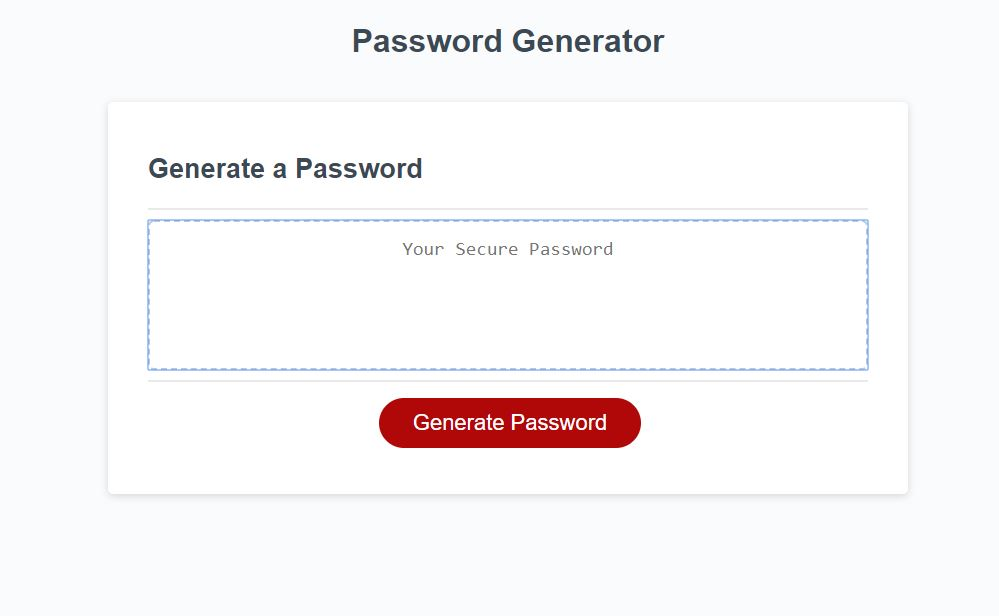

# Password Generator 
 
## Purpose
A website that provides a randomly generated password following user set criteria. The criteria include:
password length
character types included (lowercase, uppercase, #, special characters)
 
These criteria will be set in a series of window prompts. After the user selects the desired criteria the input should be validated. Currently there are three validation points: one is after determining the password length and the last two are after the last character prompt. The validation after the password length looks to see if the password length is valid (a number between 8 and 128). If it is not it displays an alert and tells the user to make a valid selection. One of the validations after character type selection makes sure that at least one character type was selected, if not they are asked to make at least one selection. The final validation takes all of the input from the user and confirms their choices. If they want to change the criteria, they will be directed to the first question again. 
 
After the criteria has been set by the user a password is displayed in the text area. Clicking the generate password button again allows the user to select new criteria. 
 
## Built With
-HTML
-CSS
-Javascript
 
## Website
https://parkerrobison.github.io/password-genrator/
 
## Preview of the application
 
## Contribution
Made by Parker Robison

